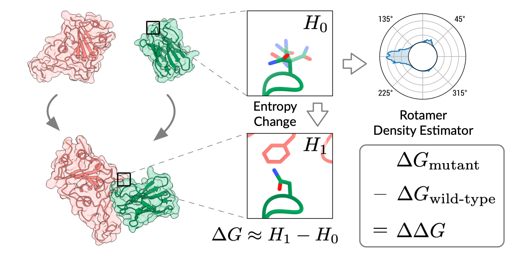

# RDE-PPI


:mountain: Rotamer Density Estimators is an Unsupervised Learner of the Effect of Mutations on Protein-Protein Interaction (ICLR 2023)

## Install

### Environment

```bash
conda env create -f env.yaml -n RDE
conda activate RDE
```

The default PyTorch version is 1.12.1 and cudatoolkit version is 11.3. They can be changed in [`env.yml`](./env.yml).

### Datasets

| Dataset   | Download Script                                    |
| --------- | -------------------------------------------------- |
| PDB-REDO  | [`data/get_pdbredo.sh`](./data/get_pdbredo.sh)     |
| SKEMPI v2 | [`data/get_skempi_v2.sh`](./data/get_skempi_v2.sh) |

### Trained Weights

https://drive.google.com/drive/folders/1jS7VCLyLZoxDyYb092Y7QqxyOGUE8iUm?usp=share_link

## Usage

### Evaluate RDE-Network

```bash
python test_rde_network_skempi.py ./trained_models/DDG_RDE_Network_30k.pt
```

### Evaluate RDE-Linear

```
python test_rde_linear_skempi.py
```

### Prediction Mutational Effects for a SARS-CoV-2 Human Antibody and Other Protein Complexes

```bash
python pointmut_analysis.py ./configs/inference/7FAE_RBD_Fv_mutation.yml
```

💡 The script can also predict mutational effects for other protein complexes. Please refer to the example configuration file  [`7FAE_RBD_Fv_mutation.yml`](./configs/inference/7FAE_RBD_Fv_mutation.yml) to create your own mutation instruction.

### Train RDE

```bash
python train.py ./configs/train/rde.yml
```

### Train RDE-Network (DDG)

```bash
python train_rde_network_skempi.py ./configs/train/rde_ddg_skempi.yml
```

## Reference

```bibtex
@inproceedings{luo2023rotamer,
  title={Rotamer Density Estimator is an Unsupervised Learner of the Effect of Mutations on Protein-Protein Interaction},
  author={Shitong Luo and Yufeng Su and Zuofan Wu and Chenpeng Su and Jian Peng and Jianzhu Ma},
  booktitle={The Eleventh International Conference on Learning Representations },
  year={2023},
  url={https://openreview.net/forum?id=_X9Yl1K2mD}
}
```

